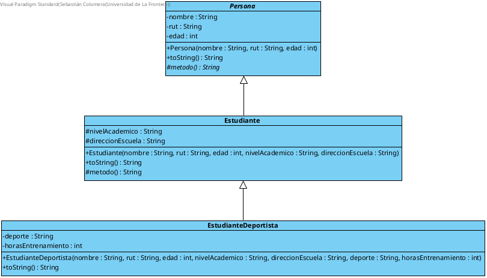

# Implicancia-Herencia

Proyecto académico que demuestra los conceptos de **Herencia**, **Clases Abstractas**, y el uso de `super` y `final` en Java.

---

## Estructura del Proyecto

```
implicancia-herencia/
├── docs/
│   └── DiagramaClases-Herencia.png   # Diagrama UML de clases
└── src/
    ├── Persona.java                   # Clase abstracta base
    ├── Estudiante.java                # Hereda de Persona
    ├── EstudianteDeportista.java      # Hereda de Estudiante (final)
    └── EjemploDeHerencia.java         # Clase principal (main)
```

---

## Jerarquía de Clases

```
Persona  (abstract)
    └── Estudiante
            └── EstudianteDeportista  (final)
```

### `Persona` — Clase Abstracta
- Atributos privados: `nombre`, `rut` (String), `edad` (int)
- Constructor parametrizado
- `toString()` — override de `Object`
- `metodo()` — abstracto, protegido, retorna `String`

### `Estudiante` — Extiende `Persona`
- Atributos propios protegidos: `nivelAcademico`, `direccionEscuela` (String)
- Constructor parametrizado con llamada a `super`
- `toString()` — extiende el de `Persona` con `super.toString()`
- `metodo()` — retorna el nombre de la clase del objeto que lo invoca

### `EstudianteDeportista` — Extiende `Estudiante` (`final`)
- Atributos propios privados: `deporte` (String), `horasEntrenamiento` (int)
- Constructor parametrizado con llamada a `super`
- `toString()` — extiende el de `Estudiante` con `super.toString()`

---

## Conceptos Aplicados

| Concepto | Descripción | Aplicado en |
|---|---|---|
| `abstract` (clase) | No se puede instanciar directamente | `Persona` |
| `abstract` (método) | Sin implementación, obliga a subclases a implementarlo | `metodo()` en `Persona` |
| `final` (clase) | No puede ser extendida | `EstudianteDeportista` |
| `final` (atributo) | No puede cambiar después de ser asignado | `nombre`, `rut`, `nivelAcademico`, etc. |
| `super` (constructor) | Llama al constructor del padre | `Estudiante`, `EstudianteDeportista` |
| `super` (método) | Reutiliza la implementación del padre | `toString()` en subclases |
| `@Override` | Sobreescritura de métodos heredados | `toString()` y `metodo()` |

---

## Diagrama UML



---

## Ejecución

### Requisitos
- Java JDK 21+
- IntelliJ IDEA (recomendado)

### Pasos
1. Clona el repositorio:
```bash
git clone https://github.com/sebastiancolomera/implicancia-herencia.git
```
2. Abre el proyecto en IntelliJ IDEA
3. Ejecuta la clase `EjemploDeHerencia.java`

### Output esperado
```
Persona{nombre=Pedro, rut=98765432-1, edad=22}, nivelAcademico = Universitario, direccionEscuela = Av. Siempre Viva 456
Estudiante
---
Persona{nombre=Juan, rut=12345678-9, edad=20}, nivelAcademico = Universitario, direccionEscuela = Av. Siempre Viva 123, deporte = Fútbol, horasEntrenamiento = 10
EstudianteDeportista
```

---

## Estrategia de Ramas (Git Flow)

```
main
 ├── feature/uml-diagram
 ├── feature/clase-persona
 ├── feature/clase-estudiante
 ├── feature/clase-estudiante-deportista
 └── feature/clase-ejemplo-herencia
```

Cada rama fue mergeada a `main` al completarse, siguiendo la convención de **Conventional Commits**:
- `docs:` para el diagrama UML
- `feat:` para cada clase implementada

---

## Herramientas Utilizadas

- **Java 21** — Lenguaje de programación
- **IntelliJ IDEA** — IDE
- **Visual Paradigm** — Modelado UML
- **Git / GitHub** — Control de versiones

---

## Autor

**Sebastian Colomera**  
Curso: Programación Orientada a Objetos(ICC490-1)
